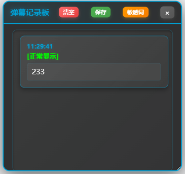

# 弹幕反诈脚本

这是一个用于拦截和处理发送到 Bilibili 直播间的弹幕请求的脚本。它可以**检测弹幕发送**并在屏幕上显示相应的提示信息。提示你在直播间发送的**弹幕是否被秒删**，**被什么秒删**，有助于用户规避河蟹词，**避免看似发了弹幕结果主播根本看不到**，不被发送成功的谎言所欺骗！

# 遥遥领先的阿瓦隆系统

你可能遇到过一种情景，你明明**重复发送了很多次弹幕**，而且你也亲眼看到了弹幕**发送成功**在屏幕上显示，但是**主播就是不对你的弹幕有所回复**，哪怕是**没几个人的小主播**直播间。  

你是否怀疑，这里是不是也介入了阿瓦隆系统自动删评，就像优秀的仅自己可见shadowban一样。  

真实情况是，**你的弹幕在发送的时候就已经被删除了**，**除了你**正在观看直播的设备显示了这条自欺欺人的弹幕，**没有任何人能看到你发出的弹幕**，你翻来覆去也想不明白，最后只想到**评论区最常见的四个字**  ————

**发送成功**  

没想到吧，这种自欺欺人的**仅自己可见**，**直播间也有！**

不过不用担心，**道高一尺魔高一丈**，这个脚本可以完美地解决这个痛点。

[点我安装](https://greasyfork.org/zh-CN/scripts/516801-[哔哩哔哩直播]-弹幕反诈与防河蟹)

## 功能

### 核心功能
- **弹幕拦截检测**：拦截发送到 `api.live.bilibili.com/msg/send` 的弹幕请求
- **智能状态判断**：根据服务器返回的信息，判断弹幕是否发送失败，如果发送成功，则提示发送成功（**可在代码中关闭此回调**）
- **可视化提示**：在弹幕发送失败时，在屏幕上显示提示信息（**仅在全屏模式生效**）
- **滚动动画**：弹幕从左侧固定位置开始向右滚动，被**主播**吃掉为**蓝色**，被**系统**吃掉为**绿色**。可修改代码实现自定义颜色，支持16进制颜色代码和颜色名称
- **自定义弹幕**：支持自定义弹幕内容和样式

### 弹幕记录与监控
- **控制台输出**：所有发送的弹幕内容都会在浏览器控制台显示，包括：
  - 系统屏蔽弹幕：显示为 "系统屏蔽弹幕: [内容]"
  - 主播屏蔽弹幕：显示为 "主播屏蔽弹幕: [内容]"  
  - 正常弹幕：显示为 "正常弹幕: [内容]"
- **实时监控**：监控每一条发送弹幕并对其核验，确保其成功发送成功
- **浮动弹幕记录板**：
  - **可视化记录**：在页面右上角显示浮动文本框，实时记录所有弹幕发送情况
  - **智能分类**：用不同颜色标识弹幕状态
    - 🔴 系统屏蔽（红色边框）
    - 🟠 主播屏蔽（橙色边框）
    - 🟢 正常显示（绿色边框）
  - **时间戳记录**：每条记录都包含精确的发送时间
  - **交互功能**：
    - 可拖拽移动位置
    - 可调整大小
    - 一键清空记录
    - 一键关闭面板

### 数据保存与分析
- **一键保存**：点击"保存"按钮即可下载所有弹幕记录
- **详细统计**：保存文件包含完整的统计信息
  - 系统屏蔽弹幕数量
  - 主播屏蔽弹幕数量  
  - 正常显示弹幕数量
  - 总记录数
- **文件格式**：保存为UTF-8编码的文本文件，文件名包含时间戳
- **可读性强**：格式化输出，便于后续分析和查看

### 敏感词管理（3.0版本新增）
- **智能检测**：自动检测弹幕中的敏感词，支持模糊匹配和精确匹配
- **可视化高亮**：敏感词在弹幕记录中以高亮形式显示，便于快速识别
- **自定义词库**：支持添加、删除自定义敏感词，构建个人专属词库
- **配置管理**：提供丰富的配置选项
  - 启用/禁用敏感词检测
  - 区分大小写设置
  - 模糊匹配开关
  - 记录板容量限制
- **本地存储**：配置自动保存到本地，刷新页面后配置不丢失
- **一键重置**：支持一键恢复默认配置和敏感词列表

### 敏感词高亮显示（3.0版本新增）
- **实时高亮**：被屏蔽的弹幕中的敏感词会以特殊样式高亮显示
- **多色标识**：使用黄色背景、红色文字、加粗字体等样式突出显示
- **智能识别**：自动识别弹幕中的敏感词并标记位置
- **可定制样式**：支持自定义高亮颜色、字体样式等显示效果
- **检测提示**：在弹幕记录中显示"⚠️ 检测到敏感词"提示信息

## 效果展示

- (示例效果，弹幕内容及颜色可自定义)
- 被系统吃掉
- 
- 被主播吃掉
- 
- 全屏情况下显示效果
- 
- 悬浮提示框示例  
- 
- 配置管理示例
- 
- 保存文件示例(txt)  
- 
- 保存文件示例(csv)
- 

## 使用方法

### 基础使用
1. 确保您使用的是支持用户脚本的浏览器扩展（如 Tampermonkey 或 Greasemonkey）。
2. 将脚本添加到您的用户脚本管理器中。
3. 访问 Bilibili 直播间，脚本将自动运行。
4. 待直播间加载完毕后，弹幕容器会提示脚本加载成功。
5. 发送弹幕，根据回调信息判断是否发送成功

### 新增功能使用

#### 查看弹幕记录
- **控制台查看**：按 F12 打开开发者工具，在控制台标签页查看所有弹幕的发送状态和内容
- **浮动面板查看**：发送第一条弹幕时，页面右上角会自动出现"弹幕记录板"
  - 实时显示所有弹幕的发送状态
  - 用颜色区分不同类型的弹幕
  - 显示精确的发送时间

#### 管理弹幕记录
- **移动面板**：拖拽标题栏可移动记录板位置
- **调整大小**：拖拽面板右下角可调整大小
- **清空记录**：点击"清空"按钮清除所有记录
- **关闭面板**：点击"×"按钮隐藏记录板

#### 保存弹幕记录
- **保存记录**：点击"保存"按钮下载所有弹幕记录
- **文件内容**：保存的文件包含：
  - 每条弹幕的详细信息和时间戳
  - 完整的统计数据分析
  - 便于阅读的格式化输出

#### 敏感词管理器使用（3.0版本新增）
- **打开管理器**：点击弹幕记录板中的"敏感词"按钮打开管理界面
- **添加敏感词**：
  - 在输入框中输入要添加的敏感词
  - 点击"添加"按钮或按回车键确认
  - 支持中文、英文、数字等各种字符
- **删除敏感词**：在敏感词列表中点击对应词条右侧的"删除"按钮
- **配置选项**：
  - **启用检测**：勾选后启用敏感词检测功能
  - **区分大小写**：勾选后敏感词检测会区分大小写
  - **模糊匹配**：勾选后支持部分匹配（包含检测）
  - **默认显示记录板**：勾选后页面加载时自动显示弹幕记录板
  - **记录容量**：设置弹幕记录板最大保存记录数（默认50条）
- **保存配置**：点击"保存配置"按钮保存所有设置
- **重置设置**：点击"重置默认"按钮恢复所有默认配置

## 代码说明

### 核心机制
- **窗口上下文**: 检测是否可以使用 `unsafeWindow` 来访问页面的 `window` 对象，如果可以，则完成脚本加载，否则弹出错误信息。
- **拦截请求**: 重写 `fetch` 函数以拦截特定的请求，用于检测弹幕是否发送成功。
- **显示信息**: 使用固定位置的 `div` 元素在屏幕上显示消息，并通过 `requestAnimationFrame` 实现从左到右的滚动效果。

### 3.0新增功能实现
- **敏感词检测引擎**: 实现高效的敏感词检测算法，支持模糊匹配和精确匹配
- **高亮显示系统**: 使用HTML标签和CSS样式实现敏感词的可视化高亮
- **配置管理系统**: 基于localStorage的配置持久化存储和实时更新机制
- **交互式管理界面**: 使用模态框和动态DOM操作构建用户友好的管理界面
- **智能词库管理**: 支持动态添加、删除敏感词，并提供重复检测和验证机制

## 自定义配置

### 基础配置
- **滚动速度**: 可以通过调整 `showFloatingMessage` 函数中的 `speed` 变量来改变弹幕滚动速度。
- **消息内容和颜色**: 在 `showFloatingMessage` 函数中修改 `message` 和 `color` 参数以自定义显示内容。
- **弹幕字号**: 同上，详见代码注释。
- **起始位置**: 同上，详见代码注释。
- **重复次数**: 同上，详见代码注释。

### 3.0新增功能配置
- **敏感词高亮样式**: 可修改 `sensitiveWordsConfig.highlightStyle` 对象中的样式参数
- **默认敏感词列表**: 可修改 `sensitiveWordsConfig.defaultConfig.words` 数组添加默认敏感词
- **敏感词检测配置**: 可调整 `sensitiveWordsConfig.defaultConfig` 中的默认配置
  - `enabled`: 是否默认启用敏感词检测（默认 `true`）
  - `caseSensitive`: 是否区分大小写（默认 `false`）
  - `fuzzyMatch`: 是否启用模糊匹配（默认 `true`）
  - `showLogBoxByDefault`: 是否默认显示记录板（默认 `true`）
  - `logBoxCapacity`: 记录板容量限制（默认 `50`）

## 注意事项

### 使用须知
- 本脚本仅用于学习目的，请勿用于非法用途。
- 使用本脚本可能会违反某些网站的使用条款，请谨慎使用。

### 注意事项
- **敏感词检测性能**：敏感词检测采用高效的算法，但大量敏感词可能影响性能，建议合理控制词库大小
- **本地存储限制**：敏感词配置保存在浏览器本地存储中，清除浏览器数据会丢失自定义配置
- **敏感词匹配**：模糊匹配模式下，敏感词作为子字符串进行检测，可能产生误报，建议根据实际需要调整
- **高亮显示兼容性**：敏感词高亮使用HTML标签实现，在某些特殊环境下可能显示异常
- **配置同步**：敏感词配置仅在当前浏览器中有效，不同浏览器或设备间不会自动同步

## 贡献

欢迎提交问题和建议！如果您有改进的想法，请随时提 PR 或 issue。

## 许可证

本项目采用 GPL 3.0 许可证。
