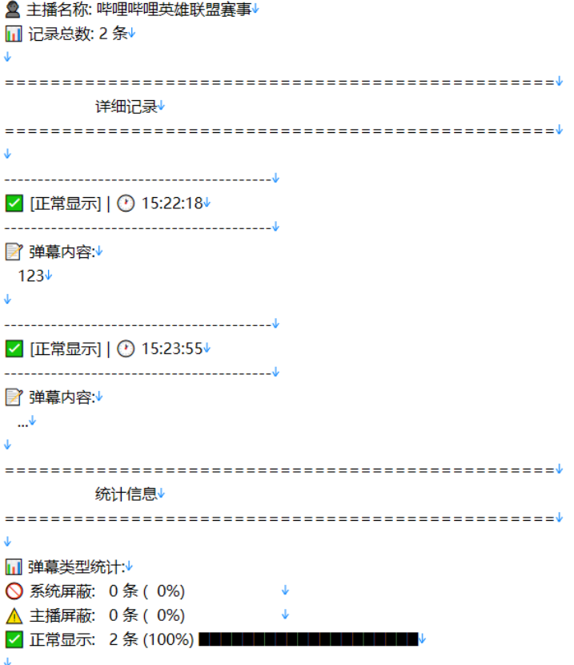

# 遥遥领先的阿瓦隆系统

你可能遇到过一种情景，你明明**重复发送了很多次弹幕**，而且你也亲眼看到了弹幕**发送成功**在屏幕上显示，但是**主播就是不对你的弹幕有所回复**，哪怕是**没几个人的小主播**直播间。  

你是否怀疑，这里是不是也介入了阿瓦隆系统自动删评，就像优秀的仅自己可见shadowban一样。  

真实情况是，**你的弹幕在发送的时候就已经被删除了**，**除了你**正在观看直播的设备显示了这条自欺欺人的弹幕，**没有任何人能看到你发出的弹幕**，你翻来覆去也想不明白，最后只想到**评论区最常见的四个字**  ————

**发送成功**  

没想到吧，这种自欺欺人的**仅自己可见**，**直播间也有！**

不过不用担心，**道高一尺魔高一丈**，这个脚本可以完美地解决这个痛点。

[点我安装](https://greasyfork.org/zh-CN/scripts/516801-[哔哩哔哩直播]-弹幕反诈与防河蟹)

# 弹幕反诈脚本

这是一个用于拦截和处理发送到 Bilibili 直播间的弹幕请求的脚本。它可以**检测弹幕发送**并在屏幕上显示相应的提示信息。提示你在直播间发送的**弹幕是否被秒删**，**被什么秒删**，有助于用户规避河蟹词，**避免看似发了弹幕结果主播根本看不到**，不被发送成功的谎言所欺骗！  

脚本修改自 TGSAN-哔哩哔哩直播弹幕反诈 ，增添了主播屏蔽弹幕发送失败时的相关信息提示，提示信息更加人性化。  

[原脚本作者](https://greasyfork.org/zh-CN/scripts/488621-哔哩哔哩直播弹幕反诈。)

## 功能

### 核心功能
- 拦截发送到 `api.live.bilibili.com/msg/send` 的弹幕请求。
- 根据服务器返回的信息，判断弹幕是否发送失败，如果发送成功，则提示发送成功（**可在代码中关闭此回调**）。
- 在弹幕发送失败时，在屏幕上显示提示信息（**仅在全屏模式生效**）。
- 弹幕从左侧固定位置开始向右滚动，被**主播**吃掉为**蓝色**，被**系统**吃掉为**绿色**。可修改代码实现自定义颜色，支持16进制颜色代码和颜色名称。
- 支持自定义弹幕。
- **重要提示！！！系统权限高于主播**，当出现河蟹关键词时**系统会优先删除**，即便主播设置了系统同样的关键词。

### 2.0新增功能

#### 1. 弹幕内容记录与输出
- **控制台输出**：所有发送的弹幕内容都会在浏览器控制台显示，包括：
  - 系统屏蔽弹幕：显示为 "系统屏蔽弹幕: [内容]"
  - 主播屏蔽弹幕：显示为 "主播屏蔽弹幕: [内容]"  
  - 正常弹幕：显示为 "正常弹幕: [内容]"
- **实时监控**：监控每一条发送弹幕并对其核验，确保其成功发送成功

#### 2. 浮动弹幕记录板
- **可视化记录**：在页面右上角显示浮动文本框，实时记录所有弹幕发送情况
- **智能分类**：用不同颜色标识弹幕状态
  - 🔴 系统屏蔽（红色边框）
  - 🟠 主播屏蔽（橙色边框）
  - 🟢 正常显示（绿色边框）
- **时间戳记录**：每条记录都包含精确的发送时间
- **交互功能**：
  - 可拖拽移动位置
  - 可调整大小
  - 一键清空记录
  - 一键关闭面板

#### 3. 弹幕记录保存功能
- **一键保存**：点击"保存"按钮即可下载所有弹幕记录
- **详细统计**：保存文件包含完整的统计信息
  - 系统屏蔽弹幕数量
  - 主播屏蔽弹幕数量  
  - 正常显示弹幕数量
  - 总记录数
- **文件格式**：保存为UTF-8编码的文本文件，文件名包含时间戳
- **可读性强**：格式化输出，便于后续分析和查看

## 效果展示

- (示例效果，弹幕内容及颜色可自定义)
- 被系统吃掉
- 
- 被主播吃掉
- 
- 全屏情况下显示效果
- 
- 悬浮提示框示例  
- 
- 保存文件示例  
- 

## 使用方法

### 基础使用
1. 确保您使用的是支持用户脚本的浏览器扩展（如 Tampermonkey 或 Greasemonkey）。
2. 将脚本添加到您的用户脚本管理器中。
3. 访问 Bilibili 直播间，脚本将自动运行。
4. 待直播间加载完毕后，弹幕容器会提示脚本加载成功。
5. 发送弹幕，根据回调信息判断是否发送成功

### 新增功能使用

#### 查看弹幕记录
- **控制台查看**：按 F12 打开开发者工具，在控制台标签页查看所有弹幕的发送状态和内容
- **浮动面板查看**：发送第一条弹幕时，页面右上角会自动出现"弹幕记录板"
  - 实时显示所有弹幕的发送状态
  - 用颜色区分不同类型的弹幕
  - 显示精确的发送时间

#### 管理弹幕记录
- **移动面板**：拖拽标题栏可移动记录板位置
- **调整大小**：拖拽面板右下角可调整大小
- **清空记录**：点击"清空"按钮清除所有记录
- **关闭面板**：点击"×"按钮隐藏记录板

#### 保存弹幕记录
- **保存记录**：点击"保存"按钮下载所有弹幕记录
- **文件内容**：保存的文件包含：
  - 每条弹幕的详细信息和时间戳
  - 完整的统计数据分析
  - 便于阅读的格式化输出
- **文件命名**：自动生成带时间戳的文件名，如 `弹幕记录_2024-01-01T12-00-00.txt`

## 代码说明

### 核心机制
- **窗口上下文**: 检测是否可以使用 `unsafeWindow` 来访问页面的 `window` 对象，如果可以，则完成脚本加载，否则弹出错误信息。
- **拦截请求**: 重写 `fetch` 函数以拦截特定的请求，用于检测弹幕是否发送成功。
- **显示信息**: 使用固定位置的 `div` 元素在屏幕上显示消息，并通过 `requestAnimationFrame` 实现从左到右的滚动效果。

### 2.0新增功能实现
- **弹幕内容提取**: 在修改响应数据前解析 `mode_info.extra` 字段，提取弹幕内容
- **浮动面板**: 使用动态创建的 DOM 元素构建可交互的记录面板
- **拖拽功能**: 通过鼠标事件实现面板的拖拽移动
- **数据保存**: 使用 Blob API 和 URL.createObjectURL 实现文件下载功能
- **智能统计**: 实时统计各类弹幕数量，提供详细的数据分析

## 自定义配置

### 基础配置
- **滚动速度**: 可以通过调整 `showFloatingMessage` 函数中的 `speed` 变量来改变弹幕滚动速度。
- **消息内容和颜色**: 在 `showFloatingMessage` 函数中修改 `message` 和 `color` 参数以自定义显示内容。
- **弹幕字号**: 同上，详见代码注释。
- **起始位置**: 同上，详见代码注释。
- **重复次数**: 同上，详见代码注释。

### 2.0新增功能配置
- **记录板样式**: 可修改 `createDanmuLogBox` 函数中的样式参数
  - 位置：`top` 和 `right` 属性
  - 大小：`width` 和 `height` 属性
  - 颜色：`background`、`border`、`color` 等属性
- **记录数量限制**: 可调整 `logDanmuToBox` 函数中的最大记录数（默认50条，可自行修改）
- **保存文件格式**: 可修改 `saveDanmuLogs` 函数中的文件内容格式（默认txt）
- **颜色标识**: 可自定义不同类型弹幕的显示颜色
  - 系统屏蔽：`#ff6b6b`（红色）
  - 主播屏蔽：`#ffa500`（橙色）
  - 正常显示：`#00ff00`（绿色）

## 注意事项

### 使用须知
- 本脚本仅用于学习目的，请勿用于非法用途。
- 使用本脚本可能会违反某些网站的使用条款，请谨慎使用。

### 2.0新增功能注意事项
- **记录板显示**：记录板会在发送第一条弹幕时自动创建，且记录版不具备记忆功能，如果页面刷新会重新创建，同时原有数据或全部丢失
- **数据持久性**：除用户手动保存，脚本不会在本地记录弹幕信息，弹幕记录仅在当前会话有效，刷新页面后记录会清空
- **性能影响**：记录板最多保存50条记录，超出会自动删除最旧的记录，可自行修改最大保存记录用来保存更多记录
- **浏览器兼容性**：保存功能需要现代浏览器支持 Blob API
- **控制台输出**：建议在开发者工具中查看控制台输出，以获得完整的弹幕信息

## 贡献

欢迎提交问题和建议！如果您有改进的想法，请随时提 PR 或 issue。

## 许可证

本项目采用 GPL 3.0 许可证。
